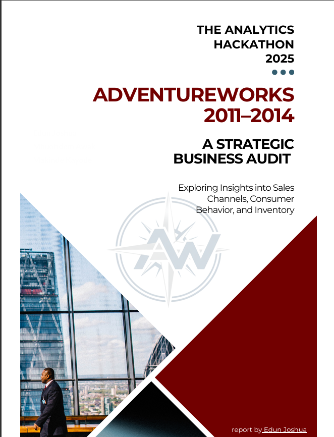
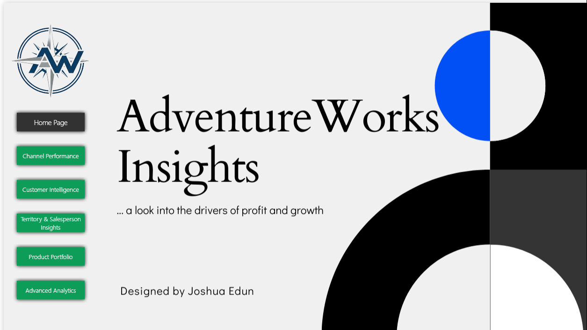

# Analytics Hackathon 2025 — AdventureWorks Business Analysis

**Challenge:** Analyze the AdventureWorks dataset to identify five high-quality, business-relevant insights across channel performance, customer behavior, and product optimization.

**Submission:** PDF Report  
🔗 [Access Full Report (PDF)](https://drive.google.com/file/d/14f_ncfHQ_GoVIj2GVt-hJfPalsSZpzcJ/view?usp=sharing)

-----
**Submission:**  
🔗 [View Interactive Dashboard](https://app.powerbi.com/view?r=eyJrIjoiZWVlM2I0OWYtZGFiMi00ZWQ2LThiZGYtYzk4MmZiMDVkNDRiIiwidCI6ImRmODY3OWNkLWE4MGUtNDVkOC05OWFjLWM4M2VkN2ZmOTVhMCJ9&embedImagePlaceholder=true&pageName=ReportSection)

---

## 📊 Project Overview

This submission presents a data-driven analysis of AdventureWorks' sales performance, customer segmentation, and product profitability. The analysis uncovers a critical **profitability paradox**: the Reseller channel drives 73% of revenue but operates at a loss, while the Online channel delivers superior margins. Key recommendations address pricing discipline, incentive realignment, and targeted retention strategies.

---

## 📁 Project Structure

### [`01_Data_Modeling/`](./Analytics_Hackathon_2025/01_Data_Modeling/)

**Database schema and ETL setup**

- `create_analytics_schema.sql` — SQL script to create analytical schema and views for AdventureWorks data
- Contains foundational tables and computed metrics used across all analyses

### [`02_Analysis_Scripts/`](./Analytics_Hackathon_2025/02_Analysis_Scripts/)

**Analytical queries organized by theme**

#### [`Theme1_Channel_Performance/`](./Analytics_Hackathon_2025/02_Analysis_Scripts/Theme1_Channel_Performance/)

- **Objective:** Analyze Online vs. Reseller channel profitability, operational metrics, and salesforce effectiveness
- **Key Finding:** Reseller channel contributes 73% of revenue but frequently operates at negative margins due to aggressive discounting
- **Queries & Views:** Channel revenue, profitability, salesforce metrics, geographic distribution

#### [`Theme2_Customer_Segmentation/`](./Analytics_Hackathon_2025/02_Analysis_Scripts/Theme2_Customer_Segmentation/)

- **Objective:** Identify customer segments using RFM analysis and understand repeat purchase behavior
- **Key Finding:** 5.5% of customers (Champions) drive a disproportionate share of revenue; average repeat purchase cycle is 161 days
- **Queries & Views:** RFM scoring, customer lifetime value, repeat purchase metrics, geographic concentration

#### [`Theme3_Product_Optimization/`](./Analytics_Hackathon_2025/02_Analysis_Scripts/Theme3_Product_Optimization/)

- **Objective:** Evaluate product profitability, bundling opportunities, and discount sensitivity
- **Key Finding:** Deep discounts (>30%) on Mountain Bikes invert margins to losses of ~$846 per unit; hero products (Mountain-200) subsidize laggards (Road-250)
- **Queries & Views:** Product rankings, market basket analysis, discount impact, channel-specific performance

### [`consolidated_scripts/`](./Analytics_Hackathon_2025/consolidated_scripts/)

**Complete SQL analysis in two formats**

- `all_queries.sql` — All exploratory and analytical queries in one file
- `all_views.sql` — All SQL Server views created for dashboarding and reporting

### [`report/`](./Analytics_Hackathon_2025/report/)

**Presentation-ready PDF report and LaTeX source**

#### Report Contents

- **Introduction** — Business context, KPIs, channel overview
- **Chapter 1: Channel Performance Analysis** — Profitability paradox, operational metrics, geographic performance
- **Chapter 2: Customer Segmentation Analysis** — RFM framework, segment distribution, repeat purchase behavior
- **Chapter 3: Product Optimization** — Hero vs. laggard products, market basket opportunities, discount sensitivity
- **Chapter 4: Conclusion & Recommendations** — Five high-impact recommendations for restoring profitability

#### Technical Details

- **Format:** LaTeX (compiled to PDF)
- **Structure:**
  - `AdventureWorks.tex` — Master document
  - `AdventureWorksThesis.cls` — Custom document class
  - `Chapters/` — Individual chapter files
  - `Matter/` — Front matter, appendices, bibliograpy
  - `Configurations/` — Typography, colors, headers, code highlighting
  - `Figures/` — Charts and visualizations

### [`scrap_data/`](./Analytics_Hackathon_2025/data/)

**supplementary files**

---

## 📈 Interactive Dashboard

**Power BI Report**  
🔗 [View Interactive Dashboard](https://app.powerbi.com/view?r=eyJrIjoiZWVlM2I0OWYtZGFiMi00ZWQ2LThiZGYtYzk4MmZiMDVkNDRiIiwidCI6ImRmODY3OWNkLWE4MGUtNDVkOC05OWFjLWM4M2VkN2ZmOTVhMCJ9&embedImagePlaceholder=true&pageName=ReportSection)

---

## 🎤 Presentation Slides

**Executive Summary & Key Insights**  
🔗 [View Presentation Slides](https://www.canva.com/design/DAG5h5eibu4/MB3Ovu6mnCFVhxnrrxO59g/view?utm_content=DAG5h5eibu4&utm_campaign=designshare&utm_medium=link2&utm_source=uniquelinks&utlId=h04be52884b)

---

## 🎯 Key Insights & Recommendations

### Insight 1: The Profitability Paradox

**Finding:** Reseller channel generates $80.5M (73%) of revenue but operates at negative margins; Online generates $29.4M but maintains ~40% margins.  
**Recommendation:** Restructure Reseller incentives to reward net profit rather than gross revenue; implement dynamic discount caps (15% ceiling).

### Insight 2: Concentrated Customer Value

**Finding:** 5.5% of online customers (Champions) and 33.8% (Loyal) account for the majority of revenue; 161-day repeat purchase cycle identified.  
**Recommendation:** Launch "Champion" VIP program and deploy automated nurture campaigns between days 90–120 post-purchase.

### Insight 3: Discount-Driven Unprofitability

**Finding:** Mountain Bikes at >30% discount incur losses of ~$846 per unit; Road Bikes at 0–5% discount yield $62 profit per unit.  
**Recommendation:** Enforce company-wide discount policy with 15% floor for high-value categories and mandatory approval gates.

### Insight 4: Imbalanced Product Portfolio

**Finding:** Hero products (Mountain-200 series, 15–20% margins) subsidize laggards (Road-250 Black, negative margins despite top-10 revenue).  
**Recommendation:** Conduct urgent profitability audit of top 20 SKUs; consider price adjustments or discontinuation for loss-making products.

### Insight 5: Market Basket & Bundling Opportunities

**Finding:** Strong co-purchase patterns (Water Bottle + Cage = 1,692 pairs; Helmet + Patch Kit = 132 pairs) reveal bundling potential.  
**Recommendation:** Create official bundles ("Reseller Build Kits," "Online Adventure Bundles") to improve AOV without eroding unit margins.

---

## 📊 Deliverables Checklist

| Deliverable              | Location                       | Status                                           |
| ------------------------ | ------------------------------ | ------------------------------------------------ |
| **SQL Scripts**          | `Analytics_Hackathon_2025/02_Analysis_Scripts/`        | ✅ All queries and views                         |
| **Documentation Report** | `report/` (PDF + LaTeX source) | ✅ Comprehensive analysis                        |
| **Dashboard**            | Power BI (link above)          | 🔗 [Interactive Report](#-interactive-dashboard) |
| **Presentation Slides**  | [link](https://www.canva.com/design/DAG5h5eibu4/MB3Ovu6mnCFVhxnrrxO59g/view?utm_content=DAG5h5eibu4&utm_campaign=designshare&utm_medium=link2&utm_source=uniquelinks&utlId=h04be52884b)    | ✅ provided as link                  |

---

## 🛠️ Tools & Technologies Used

| Tool                            | Purpose                                            |
| ------------------------------- | -------------------------------------------------- |
| **SQL Server**                  | Data exploration, schema design, view creation     |
| **Power BI**                    | Interactive dashboards, slicers, KPI cards         | |
| **LaTeX**                       | Professional PDF report generation                 |
| **Git**                         | Version control                   |

---

## 📞 Key Metrics (Summary)

| Metric                        | Value    |
| ----------------------------- | -------- |
| Total Revenue                 | $109.85M |
| Total Profit                  | $9.37M   |
| Overall Profit Margin         | 8.5%     |
| Total Customers               | 19.1K    |
| Reseller Revenue (% of Total) | 73.3%    |
| Online Revenue (% of Total)   | 26.7%    |
| Online Profit Margin          | ~40%     |
| Reseller Profit Margin        | Negative |
| Repeat Customer Rate          | 60%+     |
| Average Repeat Purchase Cycle | 161 days |

---

## 📝 Documentation & Methodology

Each chapter follows a consistent structure:

1. **Objectives** — Clear business questions addressed
2. **Methodology** — SQL and analytical approach
3. **Key Findings** — Evidence-backed insights with supporting tables/charts
4. **Business Implications** — Actionable recommendations with expected impact
5. **Limitations** — Honest discussion of data constraints and assumptions

---

## 📎 Quick Links

- 📊 [Interactive Power BI Dashboard](https://app.powerbi.com/view?r=eyJrIjoiZWVlM2I0OWYtZGFiMi00ZWQ2LThiZGYtYzk4MmZiMDVkNDRiIiwidCI6ImRmODY3OWNkLWE4MGUtNDVkOC05OWFjLWM4M2VkN2ZmOTVhMCJ9&embedImagePlaceholder=true&pageName=ReportSection)
- 📄 [Full Report PDF](https://drive.google.com/file/d/14f_ncfHQ_GoVIj2GVt-hJfPalsSZpzcJ/view?usp=sharing)
- 🎤 [Presentation Slides](https://www.canva.com/design/DAG5h5eibu4/MB3Ovu6mnCFVhxnrrxO59g/view?utm_content=DAG5h5eibu4&utm_campaign=designshare&utm_medium=link2&utm_source=uniquelinks&utlId=h04be52884b)
- 📖 [Detailed Analysis by Theme (SQL)](./Analytics_Hackathon_2025/02_Analysis_Scripts/)

---

**Last Updated:** November 28, 2025  
**Report Version:** 1.0.0
